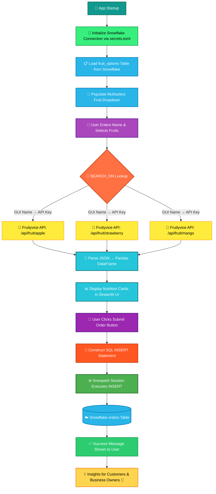

<p align="center">
  
</p>

<p align="center">
  This project is a cloud-based smoothie ordering application built using Streamlit and Snowflake. 🥤 It allows users to customize orders, select up to 5 fruits, and view real-time nutritional data. 🍓 Orders are stored directly in Snowflake using Snowpark Python. ☁️ An interactive Streamlit web app delivers a seamless ordering experience for customers and researchers. 🌿
</p>

---

## 🔗 Live Demo

<p align="center">🚀 Visit the <strong>Melanie's Smoothies Web App</strong></p>
<p align="center">
  <a href="https://melaniessmoothies-sno.streamlit.app/">
    
  </a>
  &nbsp;&nbsp;
  <a href="https://github.com/shivareddy2002/melanies_smoothies">
    
  </a>
</p>

---

## ✨ Key Highlights

✔️ Customize smoothie orders with up to **5 fruit ingredients** 🍓🍌🥝  
✔️ Fetch **real-time nutritional data** via the Fruityvice REST API 🥗  
✔️ Store and manage orders in **Snowflake cloud database** ☁️  
✔️ Dynamic **SEARCH_ON mapping** resolves GUI names to API-compatible keys 🔁  
✔️ Interactive **Streamlit web app** for seamless user experience 🌐  
✔️ Deployed publicly on **Streamlit Community Cloud** — no installation needed 🚀  

---

## 📌 Project Workflow

### 🔵 Step 1: App Startup & Connection
📥 **Initialize Snowflake Connection**  
`Streamlit` • `Snowpark` • `secrets.toml` • `Snowflake Session`
- Establish Snowflake connection via `st.connection("snowflake")`
- Load fruit options table (`FRUIT_NAME`, `SEARCH_ON`) into DataFrame

### 🟢 Step 2: Data Preparation
🧹 **Load & Prepare Fruit Options**
- Query `fruit_options` table from Snowflake
- Map GUI fruit names to API search values using `SEARCH_ON` column
- Populate multiselect dropdown dynamically

### 🟣 Step 3: Real-Time Nutrition Lookup
🌐 **REST API Integration — Fruityvice**
- On fruit selection, fetch nutrition data per fruit:  
  🍎 Calories • 🧈 Fat • 🍬 Sugar • 🌾 Carbohydrates • 💪 Protein
- Parse nested JSON → clean **Pandas DataFrame**
- Render live nutrition cards per selected fruit

### 🟠 Step 4: Order Customization & Submission
🛒 **User Interaction & Order Placement**
- Customer enters their name
- Selects up to 5 fruits from dynamic dropdown
- Clicks "Submit Order" to persist to Snowflake via SQL `INSERT`

### 🔺 Step 5: Cloud Storage in Snowflake
☁️ **Data Persistence via Snowpark**
- Construct SQL `INSERT` statement with customer name, ingredients, timestamp
- Execute via Snowpark Python session
- Order stored in `orders` table with `ORDER_FILLED = FALSE`

### 🟡 Step 6: Insights & Recommendations
💡 **Nutrition Transparency & Business Value**
- Customers make informed smoothie choices 🥤
- Business tracks all orders in real-time 📋
- Cloud-first architecture enables easy scaling 📈

---

## 🛠️ Requirements

[](https://www.python.org/)
[](https://streamlit.io/)
[](https://snowflake.com/)
[](https://docs.snowflake.com/)
[](https://pandas.pydata.org/)
[](https://requests.readthedocs.io/)

---

## 📊 Dataset / Database Design

The application works with two Snowflake tables inside the `SMOOTHIES.PUBLIC` schema.

**Table 1: `fruit_options`** — Fruit catalog with API mapping

| FRUIT_NAME   | SEARCH_ON   |
|--------------|-------------|
| Apples       | apple       |
| Blueberries  | blueberry   |
| Dragon Fruit | dragonfruit |
| Strawberries | strawberry  |
| Mango        | mango       |
| Banana       | banana      |

**Table 2: `orders`** — Customer order records

| NAME_ON_ORDER | INGREDIENTS              | ORDER_FILLED | ORDER_TS            |
|---------------|--------------------------|--------------|---------------------|
| Siva Reddy    | Apples Blueberries Mango | FALSE        | 2024-11-01 10:32:15 |
| Test User     | Strawberries Banana      | TRUE         | 2024-11-02 09:15:42 |

- **`SEARCH_ON`** → API-compatible key used to call Fruityvice (`"Strawberries"` → `"strawberry"`)
- **`ORDER_FILLED`** → Order fulfillment status (`FALSE = Pending`, `TRUE = Completed`)
- **`ORDER_TS`** → Auto-populated UTC timestamp when order was placed

---

## 🌟 Features

✨ Dynamic fruit dropdown loaded directly from **Snowflake cloud table**  
✨ Automatic **SEARCH_ON mapping** prevents API mismatches  
✨ Real-time **nutritional data fetched per fruit** via Fruityvice REST API  
✨ Supports up to **5 fruit selections** per smoothie  
✨ Integrations include:
   - ☁️ **Snowflake** — Cloud data warehouse
   - 🐍 **Snowpark Python** — Programmatic SQL execution
   - 🌐 **Fruityvice API** — Live nutrition data
   - 🎈 **Streamlit** — Interactive web frontend

✨ Interactive **nutrition tables** rendered per selected fruit 📊  
✨ Orders persisted in **Snowflake with timestamps** for business tracking  

---

## 📈 Technology Stack Overview

| 🌟 Technology          | ⚡ Role & Purpose                                                         |
|------------------------|--------------------------------------------------------------------------|
| 🐍 Python              | Core backend language — logic, API calls, SQL construction               |
| 🎈 Streamlit           | Frontend UI framework — form inputs, dropdowns, DataFrame display        |
| ❄️ Snowflake           | Cloud data warehouse — stores `fruit_options` and `orders` tables         |
| 🐼 Pandas              | Data manipulation — JSON normalization, DataFrame creation               |
| 🌐 Requests            | HTTP library — REST API calls to Fruityvice                              |
| 🔗 Snowpark Python     | Python-native Snowflake API — session creation, SQL execution            |
| 🚀 Streamlit Cloud     | Deployment platform — public hosting with secrets management             |
| 🐙 GitHub              | Version control — source code hosting and collaboration                  |

---

## 🏆 Results

- ✅ Fully functional cloud-connected ordering system built end-to-end
- ✅ Real-time nutrition data displayed for every fruit selection 🍎
- ✅ Orders reliably inserted into Snowflake with correct timestamps ☁️
- ✅ SEARCH_ON mapping eliminated all API 404 errors 🔁
- ✅ Successfully migrated from Streamlit-in-Snowflake to Streamlit Community Cloud 🚀
- ✅ Helps customers make health-informed smoothie choices 🥤

---

## 🗂️ Project Workflow Diagram



---

## 🗂️ Project Structure

```
melanies_smoothies/
│
├── 📄 streamlit_app.py          # Main app — UI, API calls, Snowflake logic
├── 📄 requirements.txt          # Python dependencies
├── 📄 README.md                 # Project documentation
│
└── 📁 .streamlit/
    └── 🔐 secrets.toml          # Snowflake credentials (excluded from git)
```

---

## ⚙️ Installation & Setup

### Step 1: Clone Repository

```bash
git clone https://github.com/shivareddy2002/melanies_smoothies.git
cd melanies_smoothies
```

### Step 2: Create Virtual Environment

```bash
python -m venv venv
source venv/bin/activate        # macOS/Linux
venv\Scripts\activate           # Windows
```

### Step 3: Install Dependencies

```bash
pip install -r requirements.txt
```

### Step 4: Set Up Snowflake Tables

```sql
CREATE DATABASE IF NOT EXISTS SMOOTHIES;
USE SCHEMA SMOOTHIES.PUBLIC;

CREATE OR REPLACE TABLE fruit_options (
    FRUIT_NAME  STRING,
    SEARCH_ON   STRING
);

INSERT INTO fruit_options VALUES
('Apples','apple'), ('Blueberries','blueberry'),
('Dragon Fruit','dragonfruit'), ('Strawberries','strawberry'),
('Mango','mango'), ('Banana','banana'), ('Kiwi','kiwi');

CREATE OR REPLACE TABLE orders (
    NAME_ON_ORDER  STRING,
    INGREDIENTS    STRING,
    ORDER_FILLED   BOOLEAN DEFAULT FALSE,
    ORDER_TS       TIMESTAMP_NTZ DEFAULT CURRENT_TIMESTAMP
);
```

### Step 5: Configure Secrets

Create `.streamlit/secrets.toml`:

```toml
[connections.snowflake]
account                   = "YOUR_ACCOUNT_IDENTIFIER"
user                      = "YOUR_USERNAME"
password                  = "YOUR_PASSWORD"
warehouse                 = "COMPUTE_WH"
database                  = "SMOOTHIES"
schema                    = "PUBLIC"
role                      = "SYSADMIN"
client_session_keep_alive = true
```

> ⚠️ Add `.streamlit/secrets.toml` to your `.gitignore` — never commit credentials.

### Step 6: Run the App

```bash
streamlit run streamlit_app.py
```

---

## 🔥 SQL Commands Reference

```sql
-- Add SEARCH_ON column
ALTER TABLE fruit_options ADD COLUMN SEARCH_ON STRING;

-- Update mappings
UPDATE fruit_options SET SEARCH_ON = 'strawberry' WHERE FRUIT_NAME = 'Strawberries';
UPDATE fruit_options SET SEARCH_ON = 'apple'       WHERE FRUIT_NAME = 'Apples';

-- View all orders
SELECT * FROM orders ORDER BY ORDER_TS DESC;

-- View pending orders
SELECT * FROM orders WHERE ORDER_FILLED = FALSE;

-- Mark order as filled
UPDATE orders SET ORDER_FILLED = TRUE WHERE NAME_ON_ORDER = 'Siva Reddy';
```

---

## 🔮 Future Improvements

- 🚀 Integrate **real-time IoT sensor feeds** for live ingredient tracking
- 📊 Add **Power BI / Excel dashboards** for business owner analytics
- 🤖 Implement **AI-powered smoothie recommendations** based on nutrition goals
- 🔐 Add **user authentication** and order history for returning customers
- 📱 Build a **mobile-responsive design** for on-the-go ordering
- 💳 Integrate **Stripe payment gateway** for end-to-end transactions
- 🔔 Add **order tracking & push notifications** for customers

---

## 🙌 Acknowledgements

Special thanks to:

- ❄️ **[Snowflake](https://snowflake.com)** — Robust cloud data warehouse platform
- 🎈 **[Streamlit](https://streamlit.io)** — Developer-friendly UI framework & free cloud hosting
- 🍓 **[Fruityvice API](https://fruityvice.com)** — Free REST API for fruit nutritional data
- 🐍 **Open-Source Python Community** — Pandas, Requests, and ecosystem libraries
- 📚 **Data Engineering Workshop Labs** — Guided curriculum and project inspiration

---

## 👨‍💻 Author

**Lomada Siva Gangi Reddy**
- 🎓 B.Tech CSE (Data Science), RGMCET (2021–2025)
- 💡 Interests: Python | Data Engineering | Cloud | Streamlit | Snowflake
- 📍 Open to **Internships & Job Opportunities**

**Contact Me:**

- 📧 **Email**: lomadasivagangireddy3@gmail.com
- 📞 **Phone**: 9346493592
- 💼 [LinkedIn](https://www.linkedin.com/in/lomada-siva-gangi-reddy-a64197280/) &nbsp; 🌐 [GitHub](https://github.com/shivareddy2002) &nbsp; 🚀 [Portfolio](https://lsgr-portfolio-pulse.vercel.app/)

---## 👨‍💻 Author  

**Lomada Siva Gangi Reddy**  
- 🎓 B.Tech CSE (Data Science), RGMCET (2021–2025) | CGPA: 8.3
- 💡 Skills: Python, SQL, Snowflake, ETL, ML, DL, NLP, AI, Power BI 
- 💼 SnowPro Core Certified | Data Engineering Intern (Boolean Data Pvt. Ltd.)
- 📍 Hyderabad, India | Open to Data & AI Opportunities

 **Contact Me**:  

- 📧 **Email**: lomadasivagangireddy3@gmail.com  
- 📞 **Phone**: 9346493592  
- 💼 [LinkedIn](https://www.linkedin.com/in/sivareddy2002/)  🌐 [GitHub](https://github.com/shivareddy2002)  🚀 [Portfolio](https://sivareddy2002.vercel.app/)

---
<p align="center">
  <strong>⭐ If you found this project helpful, please consider starring the repository!</strong>
</p>

<p align="center">
  <a href="https://github.com/shivareddy2002/melanies_smoothies">
    
  </a>
</p>

<p align="center">
  
</p>
